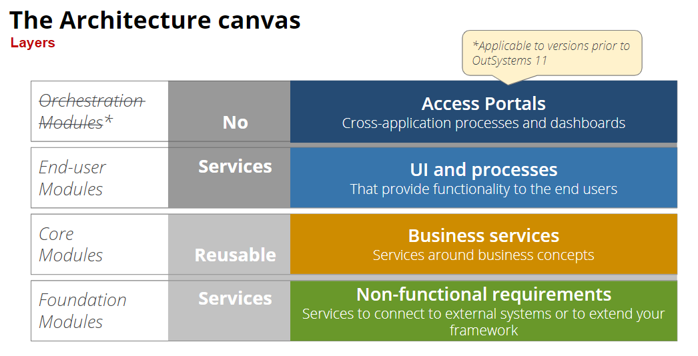
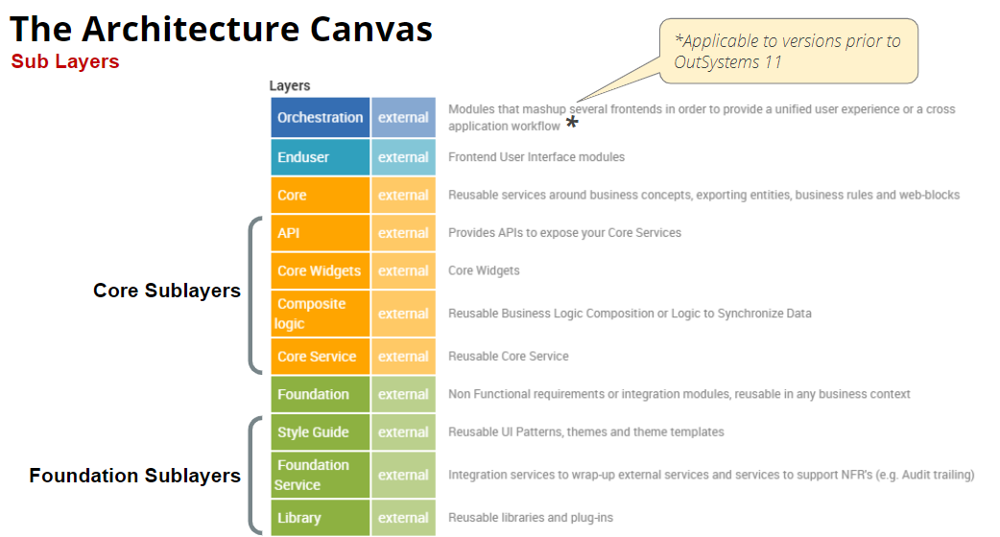
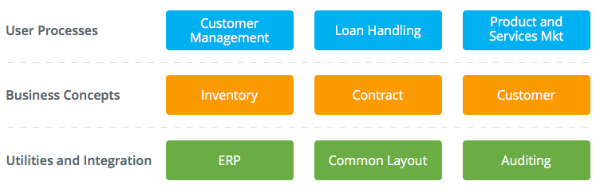
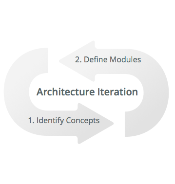

# The Architecture Canvas

The Architecture Canvas is an OutSystems architecture tool to make the design of Service-Oriented Architectures (SOA) simple. It promotes the correct abstraction of reusable (micro)services and the correct isolation of distinct functional modules, in cases where you are developing and maintaining multiple applications that reuse common modules. A typical medium to large OutSystems installation will support 20+ mission critical applications and 200+ interdependent modules.

These applications/modules have different change life cycles and are maintained and sponsored by different teams. New applications tend to evolve fast while highly reused services will change much slower. The most important benefit you get out of a well designed architecture is that applications and the modules that compose them will preserve independent lifecycles and decrease to a minimum dependencies and overall change impact. The result is a cost-effective OutSystems architecture design, easier to maintain and evolve.

## The layers and sub layers

Each layer and sub layer sets a different nature of the functionality to be captured in a module:

The orchestration layer is used in OutSystems 10 for hyperlinks between screens of two different applications. Such links are considered strong dependencies, which compromise each application's lifecycle independence. In OutSystems 11 screen destinations are considered weak references, so an orchestration layer is no longer required, and as such has been removed from the architecture canvas.

Sub layers are shown in detail below:

## Architecture design with the Architecture Canvas

The Architecture Canvas is used in two different stages of the architecture design:

1. **Identifying concepts (functional, non-functional and integration needs)**
The canvas helps collecting architecture requirements in a structured and systematic way.

2. **Define modules**
Design the modules that implement the identified concepts, following [recommended patterns](https://success.outsystems.com/Support/Enterprise_Customers/Maintenance_and_Operations/Designing_the_architecture_of_your_OutSystems_applications/05_Integration_Patterns_for_Core_Services_Abstraction).

Designing an architecture is not a one-time event. It is a continuous process. The architecture must be iterated, cycling these two stages, as a solution evolves and new concepts and needs emerge from your business.

## Using the Architecture Canvas

To start using the Architecture Canvas check the following articles:

* [Translating business concepts into application modules](https://success.outsystems.com/Support/Enterprise_Customers/Maintenance_and_Operations/Designing_the_architecture_of_your_OutSystems_applications/02_Translating_business_concepts_into_application_modules)

* [Validating your application architecture](https://success.outsystems.com/Support/Enterprise_Customers/Maintenance_and_Operations/Designing_the_architecture_of_your_OutSystems_applications/03_Validating_your_application_architecture)

## More information

Check out the [Electronic Canvas tool](http://www.outsystems.com/forge/component/706/electronic-canvas/), available in the OutSystems Forge. It assists you in the design of a new architecture by allowing you to place and move around your concepts in a digital Architecture Canvas. It enables you to identify and organize all the architectural elements that need to be implemented in a new project.

To learn more about how to design your application architecture check the [Designing the architecture of your OutSystems applications](https://success.outsystems.com/Support/Enterprise_Customers/Maintenance_and_Operations/Designing_the_architecture_of_your_OutSystems_applications) guide.

