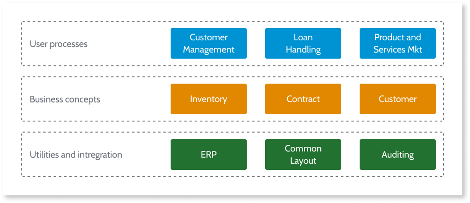

# Translating business concepts into application modules

Once you identify your concepts, you must translate them into application modules. To do so correctly, it is key you find the correct balance between:

1. Not having to handle too many modules and;

2. Having a manageable complexity and life cycle independence for each module. 

## Finding the right concept granularity

Consider the following example of concepts identified with the [Architecture Canvas](https://success.outsystems.com/Support/Enterprise_Customers/Maintenance_and_Operations/Designing_the_architecture_of_your_OutSystems_applications/01_The_4_Layer_Canvas) method.

The number of modules that need to be defined to implement these concepts depends on the concept granularity. To define an architecture, concepts don’t need to be captured at very low level (like in this example). However, the correct granularity is influenced by the following criteria:

Complexity
:   A concept may be too vast to be implemented in a single module. For example, user process **Customer management** may include several sub-processes: provisioning a new customer, analyzing customer trends, adding a service to a customer, among others.

    Split it into several modules to keep the complexity of each module manageable.

Independent life cycles
:   Even if you predict that all the sub-concepts together don’t result in a complex module, splitting a module in smaller concepts is also required if you need to manage functionality independently.

    This allows you to parallelize development among different developers or keep different evolution paces for different business sponsors.

Service isolation
:   There are several [integration patterns to correctly abstract services](https://success.outsystems.com/Support/Enterprise_Customers/Maintenance_and_Operations/Designing_the_architecture_of_your_OutSystems_applications/05_Integration_Patterns_for_Core_Services_Abstraction), requiring you to split a concept in several technical components according to the scenario.

## Validating your architecture

To make sure the way you organized your concepts comply with Architecture Canvas recommendations, check the following article to learn how you can [validate your application architecture](https://success.outsystems.com/Support/Enterprise_Customers/Maintenance_and_Operations/Designing_the_architecture_of_your_OutSystems_applications/03_Validating_your_application_architecture).

## More information

Check the complete guide on how to design your application architecture in [Designing the architecture of your OutSystems applications](intro.md).
