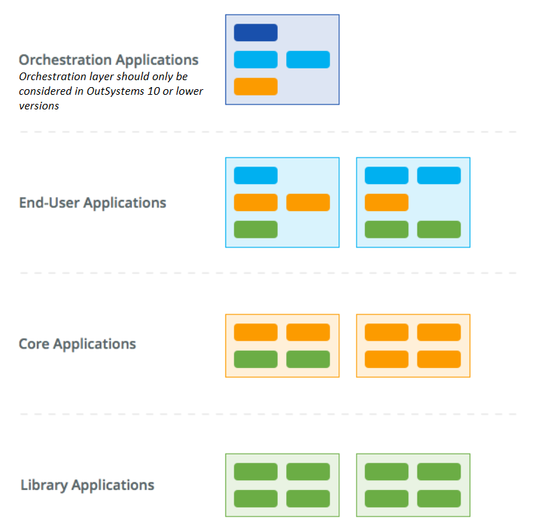
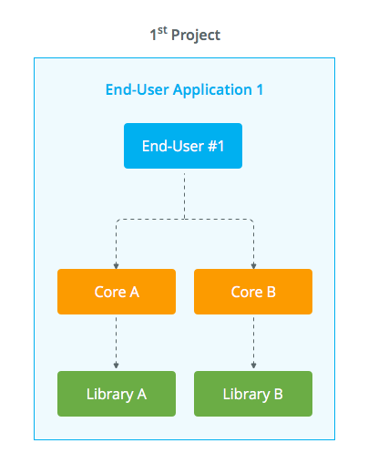
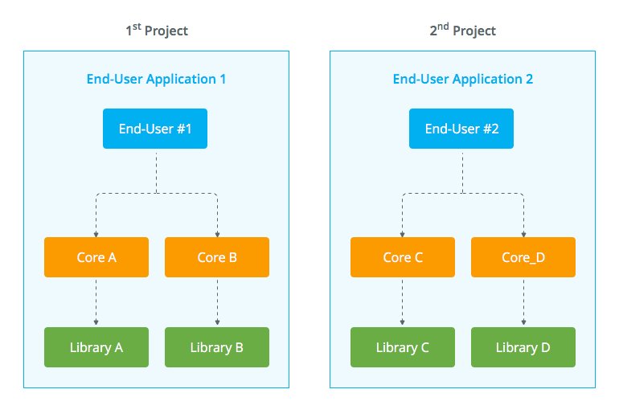
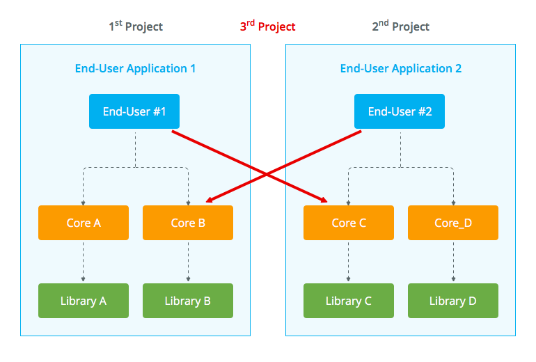
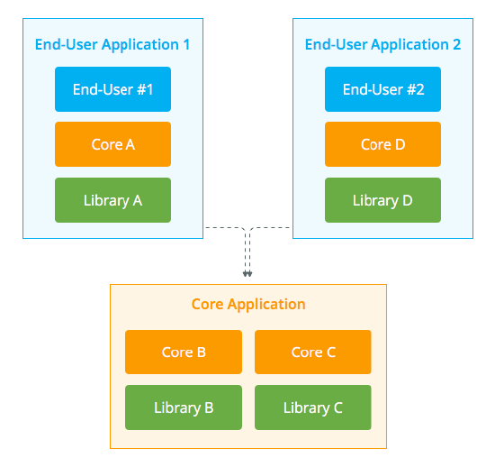

# Applying the Architecture Canvas to applications

To analyze the application architecture, the [Architecture Canvas](https://success.outsystems.com/Support/Enterprise_Customers/Maintenance_and_Operations/Designing_the_architecture_of_your_OutSystems_applications/01_The_4_Layer_Canvas) principles play a major role, just like with module architecture.

The same way individual modules are classified in an Architecture Canvas, each application is also placed in one of the layers.

Applications should be placed in the same layer as the top-most module layer in it. The following representation displays the nature of the modules that compose each application, as well as the application adopting the nature of its top-most module.

Applications are subject to the same validation rules, respecting the relations between them:

1. No upward references

2. No side references among **End-User** applications or **Orchestration** applications

3. No cyclic references between two applications

The same rationale applies for modules and for applications. **Orchestration** and **End-user** applications should not provide reusable services to ensure their life cycle independence. For example, an **End-User** application can contain reusable **Core** and **Library** modules, as long as they are consumed only by other modules of the same application.

## Evolving your architecture along with your applications

To better understand the dependencies among applications, consider the following typical scenario.

### First project

Commonly, people don’t start thinking about defining several applications, starting with one application per project. 

In the first project, a new application is created to hold all the modules that were conceived at the architecture design stage. This application results from the blending of components that will eventually be versioned and deployed to a Quality Assurance environment.

### Second project

On a second similar project, another application for a different business process is created, adding a few more **Core** and **Library** modules.

### Third project

Soon, in a third evolution project, **End-user #1** starts reusing **Core C** and **End-user #2** starts reusing **Core B**. Although there is no violation in terms of module architecture, the two **End-user** applications have side references to each other - a cycle in fact.

This clearly implies that the two applications are strongly coupled. Deploying a new version of the first to Production may require to take the second along, and vice-versa.

### Solving the issues

The commonly reused resources must be isolated in a new application, as displayed in the following diagram - the **Core Application**.

Not only **Core B** and **Core C**, that are directly referenced, must be moved to this application, but also all their dependencies (**Library B** and **Library C**) to avoid upward references to the **End-user** applications.

With this configuration, the **End-user** applications can evolve independently at different paces. In addition, the **Core** application isolates the critical resources that must be carefully evolved to manage impacts.

Validation of the application architecture can also be done with the [Discovery tool](http://www.outsystems.com/forge/component/409/discovery/).

## Correctly composing applications

There are [four rules ](https://success.outsystems.com/Support/Enterprise_Customers/Maintenance_and_Operations/Designing_the_architecture_of_your_OutSystems_applications/Application_composition/02_The_4_rules_for_correct_application_composition)that will help you make sure that you address the critical points when composing your applications.

Another common aspect you need to take into account is [isolating an application Theme ](https://success.outsystems.com/Support/Enterprise_Customers/Maintenance_and_Operations/Designing_the_architecture_of_your_OutSystems_applications/Application_composition/03_Isolating_an_application_Theme)to share the same look & feel among your applications.

## More information

To learn more about how to design your application architecture check the [Designing the architecture of your OutSystems applications](https://success.outsystems.com/Support/Enterprise_Customers/Maintenance_and_Operations/Designing_the_architecture_of_your_OutSystems_applications) guide.

You can also check for further recommendations on how you should [compose your application landscape](https://success.outsystems.com/Support/Enterprise_Customers/Maintenance_and_Operations/Designing_the_architecture_of_your_OutSystems_applications/Application_composition).

