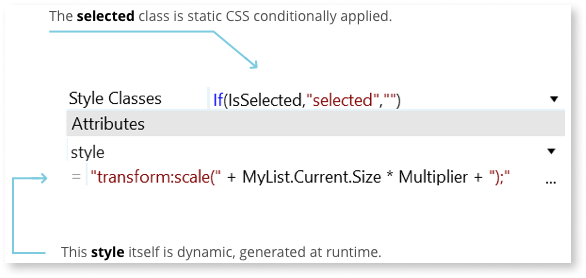
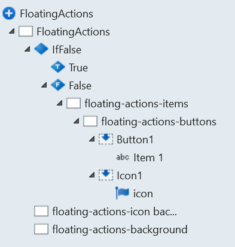
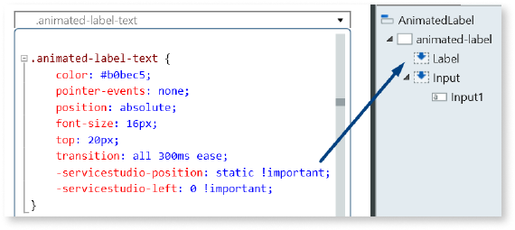
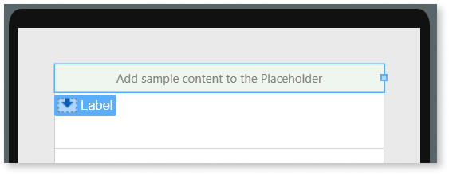
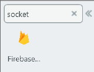
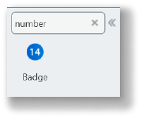
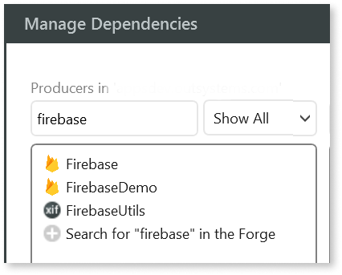
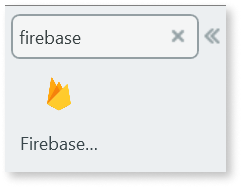

# The complete guide to creating components

This article guides you through the steps to create a reusable component in OutSystems. It includes recommendations, best practices, and information for common scenarios.

## Introduction

Components are one of the most important aspects of **low-code** [**platforms**](https://www.outsystems.com/platform/), as they enable **code reusability** and repositories of **component libraries**. As a result, developers can build high-quality app components and share them with others, boosting application development time and code fragmentation.

If you want to share your component in [OutSystems Forge](https://www.outsystems.com/forge/) and to have it validated by the OutSystems curation team, make sure your component complies  with all of the [trusted component requirements](https://success.outsystems.com/Support/Forge_Components/Forge_FAQs/Trusted_asset_requirements).

## What's a component?

A component is a reusable object that speeds up application creation and delivery. It can be either an application or a module that provides additional features. It should be easy to use and understand, and it should focus on a common use case. 

After you create a component, you can apply it in any of these ways:

* **Modularize your code** to reuse within your application (applying the Don't Repeat Yourself principle - [DRY](https://en.wikipedia.org/wiki/Don%27t_repeat_yourself)).

* Use it as an **infrastructure piece for your factory**, to reuse in more than one application.

* **Published it to the Forge**, where it can serve multiple apps and developers.

The successful creation of a component encompasses:

* Deciding its **purpose**.

* Designing an **API** and **logic** that support the main scenarios.

* Defining the **presentation** by giving it the right names and icons, for example.

* Following a set of best practices that enhance the **experience of reuse** and **maintenance**.

* Making sure you cover **non-functional requirements**, such as performance, security, and scalability.

* Planning the **release** and letting your component see the light of day.

The most common component categories, which you can [share in OutSystems Forge](https://success.outsystems.com/Support/Forge_Components/Forge_FAQs/Overview#What_kind_of_projects_can_I_share_or_use.3F), are:

* Integrations
* Device capabilities
* User Interface
* Functional libraries & utilities
* Development tools

See how you can [use a component made by the community](https://success.outsystems.com/Documentation/11/Getting_Started/Use_a_Forge_Component_Made_by_the_Community).

## Creating a component: planning

Before you start building a component, plan what you want it to do. For example, what **options** should it have? What should the **default behavior** be? What are the most **important use cases** and how should your component address them?

A **component is usually a set of blocks and actions** that you distribute as a module and/or an application. For example, if you want to modularize your own code, your component would most likely be a new block. If you're planning to release it to your factory or publicly, your component should be a module for use inside an application.

If you're creating a component that contains only logic, consider creating an empty module so it doesn't contain UI dependencies. This approach makes your component lightweight and simpler to reuse.

Alternatively, if your component contains UI elements, start by creating a module with a template. This approach provides you with an optimal structure built for that purpose.

Consider your scenarios to build successfully from the start.

## Creating a component: building

After defining the purpose of your component, you can start to build it by defining any relevant UI elements, actions, and logic.

Keep in mind that your components must fit into the [Architecture Canvas](../../architecture/architecture/intro.md) methodology used to build OutSystems applications.

### Take advantage of modern web features using Reactive Web

[Reactive Web Apps](https://www.outsystems.com/blog/posts/all-you-need-to-know-about-reactive-web/) are high performance and scalable. Building Reactive Web Apps boosts the development experience across web and mobile.

When building web components, promote Reactive Web over Traditional Web.

### API design to offer the best options

There's no point to owning a great car if you don't know how to drive it. The same applies to a component. During implementation, keep in mind the developer experience and skill set. As such:

* Keep the API small in scope and simple to understand. For example, instead of offering a 360-degree input for alignment, simply offer top, bottom, right, and left.

* Focus the API on the **main use cases** and offer the best **defaults**. Other options can come through an extensibility mechanism.

* Consider **limiting the number of inputs** to only those necessary for the component's default behavior.

One trick to expand your component configuration options without adding multiple **inputs** is to add one more that receives all extended options as JSON. Make sure you explain the available JSON options on both the input and component descriptions.

If you have a lot of advanced scenarios, consider having a page dedicated to explaining the  extensible options. In case you're publishing your component to Forge, you include the explanation on the page that the Try Now button links to.

### Reusable CSS and JavaScript

#### Style classes to simplify customization

Be sure to take advantage of expressions in the **Style Classes** property. This approach  generates code that changes the "class" attribute instead of using the "style" one, preventing unnecessary data on your DOM and **simplifying customization**. Keep in mind that everything that's static but conditional can be a CSS class, so use the inline style attribute only when you have a dynamic style. You may also leave a comment explaining the math behind it.

#### CSS selectors for enhanced reusability

Using only classes in your CSS selectors limits reusability of your component because you can only reference one instance of it, limiting multiple uses on the same screen. Follow the steps below to create **CSS selectors in relation to a specific instance** of the component, instead of using classes only:

1. Add a wrapper div and set the "Name" property.

    

1. In the action that includes the JavaScript node with the selector, add an input parameter and set it as the MyBlockWrapper element ID.

    

1. Build your selector with a CSS class related to the ID you passed as an input. In this example, the element where the CSS class exists is a child of the Wrapper element, but it could also be the same element.

    

    

#### Balancing limits and customization

When writing your code, especially CSS and JavaScript, keep it flexible. Developers may want to **change the UI and UX elements** of your component.

* **Avoid the "!important" CSS tag**. Though it could sometimes be the right choice, it does override a developer's custom CSS, limiting customization.

* **Avoid setting colors and buttons**, as they aren't east to override. If you have UI elements that trigger actions, such as buttons, consider replacing them with placeholders so developers can add their own UI elements and decide what actions or logic to execute.

#### Creating for extensibility

When designing the component's API, provides mechanisms for the developer to **extend its functionality**. For example, a component that created JavaScript Objects should have a function that provides access to them. This way, the developer can add features, creating a component that wraps another.

### Using lifecycle events correctly (mobile and reactive web apps only)

When developing a component, understanding the lifecycle of screens and blocks helps you to control the component's data and behavior. For example, this understanding helps you when defining default values for variables or deleting data that becomes irrelevant. Having a complete understanding of the lifecycle behavior allows you to **predict issues** and **optimize performance**.

See the documentation for [Screen and Block Lifecycle Events](https://success.outsystems.com/Documentation/11/Developing_an_Application/Implement_Application_Logic/Screen_and_Block_Lifecycle_Events) for more information. This section covers the most relevant events for components.

#### Use OnInitialize to define default values for variables

Imagine that you have a screen with a local boolean variable with a default `False` value. After the screen logic executes, the value changes to `True`, and you navigate to another screen. At runtime, a variable's value (defined as [model](https://en.wikipedia.org/wiki/Model%E2%80%93view%E2%80%93controller)) is saved, so you can restore it when a Back Navigation occurs (also known as Previous Screen Navigation).

After this navigation, the variable is `True`, but you might want to reset the screen state. So when you're using variables with default values, always consider these navigation scenarios, and, if needed, assign the default value on the [OnInitialize](https://success.outsystems.com/Documentation/11/Developing_an_Application/Implement_Application_Logic/Screen_and_Block_Lifecycle_Events#on-initialize) event handler.

#### OnDestroy to prevent memory leaks

Some components create global variables, event listeners, or other data during their usage. Consider removing/deleting that data on the [OnDestroy](https://success.outsystems.com/Documentation/11/Developing_an_Application/Implement_Application_Logic/Screen_and_Block_Lifecycle_Events#on-destroy) event.

#### OnRender for rendering and data changes

If your component includes UI, the [OnRender](https://success.outsystems.com/Documentation/11/Developing_an_Application/Implement_Application_Logic/Screen_and_Block_Lifecycle_Events#on-render) event is important because it runs each time the Screen or Block is rendered. For example, it runs whenever data changes on a screen.

### Configuring a good preview { #good-preview }

For a better development experience, ensure a great preview displays in Service Studio. A good preview helps developers avoid undesirable UI element styles.

#### False conditions for better previews

When you use an **If** widget with a `False` condition, developers see a friendly UI that allows them to **hide placeholders** that occupy a large amount of UI space, for example, a side panel or bar.

You can use it to display an image that replaces a runtime UI or adds UI to a component that doesn't have one. For example, use a false condition for a chart that JavaScript generates or a plugin block that propagates events.

The following example of the Silk Ui Mobile FloatingActions pattern provides a clickable circle that expands to provide extra options:

#### Service Studio CSS Tags for a better development experience

CSS properties prefaced with **-servicestudio-** can **improve the preview and development experience**. This approach allows you to more easily adapt the layout during development time, for example, when you have a placeholder with an "absolute" that you want to keep static to allow the developer to add content. Because the editor renders all CSS instructions, the elements might become inaccessible in the editor.

Using **-servicestudio-** tags helps developers set the values without compromising other features:

#### Sample content inside placeholders

A [placeholder](https://success.outsystems.com/Documentation/11/Reference/OutSystems_Language/Mobile_Interfaces/Designing_Screens/Placeholder_Widget) should have sample content if it's directly connected to a behavior or structure. This allows the developer to know what the component expects in that placeholder. For example, both Silk UI Search and AnimatedLabel blocks have an input as sample because the blocks require one to work properly.

Avoid using sample content for simple things, such as texts and images, because it's distracting and developers must delete it. Instead, add sample content only if it's mandatory or it helps developers.

 

 

### Non-functional requirements

#### Scalability

Build for the future by making sure your component can support **multiple blocks on the same screen**.

Consider **concurrency scenarios**. OutSystems already helps with this in the background by keeping blocks separated, but you still need to be aware of actions triggered by users. For example, several fast clicks on a button, triggering multiple calls to the server, is one possible concurrency scenario.

If the **component fetches data**, consider allowing the developer to **fetch it outside the component** and provide that data (to the component) as an input parameter, instead of having the component fetch the data.

When using **external resources** (for example, external libraries, or JSON files), consider reusing them instead of fetching them again. For example, the System Action [RequireScript](https://success.outsystems.com/Documentation/11/Reference/OutSystems_APIs/System_Actions#Client_RequireScript) uses the cached file if once you've requested it.

Read the complete description on how OutSystems handles scalability, in a way that's adjustable to specific requirements.

#### Security

When it comes to security, consider that any device is vulnerable. Therefore, focus on keeping **data safe**.

Since everything on the **client side can be accessed and is more vulnerable**, make sure you **protect any sensitive data**. Use this [plugin](https://www.outsystems.com/forge/component/1500/ciphered-local-storage-plugin/) to cipher your data.

Keep server-side communications safe by implementing **server-side validations**, especially permission roles.

When possible, enforce [HTTPS security](https://success.outsystems.com/Documentation/11/Developing_an_Application/Secure_the_Application/Secure_HTTP_Requests) on your screens, pages, and integrations.

Read the complete description of [how OutSystems handles security](https://success.outsystems.com/Support/Security/Application_security_overview), including its default features that work to ensure data security during the entire lifecycle of mobile and web apps.

#### Performance

OutSystems prevents performance bottlenecks with **design-time validation**. When OutSystems generates the source code for applications, it optimizes code performance at all application layers.

You should still test your component with more than a few sample records. Set up a scenario that's as realistic as possible, and test your component under **probable conditions**.

Go the extra mile and consider **peaking the number of records or conditions**, or test scenarios with thousands of concurrent users. If your component reaches the server, it could impact performance.

## Creating a component: presenting

Reusability and simplicity are key when creating a component. Components should be easy to understand and should focus on the main use cases. **Names**, **descriptions** and **visual cues**, such as icons, make it easier for developers to understand and use your component.

### Names and descriptions

**Names and descriptions help people to understand the goal of your component and how to use it**. Names should be clear and should clarify what a component does. The public-facing parts of the component should have comprehensive, front-loaded and succinct descriptions.

A complete component overview also describes things such as library URLs, API versions, and references to external resources.

Keep in mind these naming conventions:

* Use **meaningful names** (for example, "Cropper", instead of "Cppr").
* Use [**PascalCase**](https://en.wikipedia.org/wiki/PascalCase) (for example, "FirebaseReceiver", instead of "Firebasereceiver").
* Use **event names that start with "On"** (for example, "OnReady", instead of "Ready").

Take a look at the complete list of OutSystems [Naming Conventions](../platform-best-practices/outsystems-platform-best-practices.md).

**Descriptions provide visual cues during development, enhancing that experience**. For example:

* Hover over **application dependencies** to see their description.
    
    

* Check a module's description, by hovering in the **Manage Dependencies** popup window.
    
    

* The search box allows you to search for the name and the description. Note that only components with an icon appear in the toolbox on the left.

    

    

### Icons for visual reference { #icons }

Visual programming environments have graphical or iconic elements to for interactive use. Icons are important because developers actually see them in the development environment.

The first recommendation is to **use images that identify the component**. For example, the [Firebase Connector](https://www.outsystems.com/forge/component/1406/firebase/) has as an icon, which is the Firebase company logo.

The second recommendation is to **use the same image from the Application level all the way to the Actions level**. This approach provides consistency and allows developers to easily identify all your component pieces.

#### Application icons

Setting an application icon defines the **main icon of your component**. Users can relate everything that has this icon to the component. The application icon appears  throughout the component and its references. For example, it could even appear in the component's documentation.

For application icons, use *.png* format to allow transparencies and 1024 x 1024 px as the size. Keep in mind the file size as large files slow the screen-loading speed.

#### Module icons

Setting icons for modules allows developers to relate them to your application in the Manage Dependencies window. 

Module icons should be 1024 x 1024 px.

#### Block icons

Setting icons for blocks helps developers identify which component the UI element belongs to. When you search for elements, you can immediately see the blocks related to your component.

The size of block icons (.ico format) should be 32 x 32 px.

#### Action icons

Setting image icons for actions helps to easily identify which component an action in a flow belongs to.

#### Client and Server Action icons

Service Studio visually distinguishes Client Actions and Server Actions. This visual distinction helps users understand not only the context of the action but also the relevant scope.

For example, if you're working on a client-side form for an offline application you use client-side validations and avoid Server Actions. Your component should make the same distinction if possible and applicable.

If you're implementing both Client and Server Actions, consider using different styles for the same icon. OutSystems already provides you with the default icons for Client and Server Actions. If you want to change them, make replacement icons 32 x 32 px.

## Maintaining a component

You should keep your code tidy and organized. This makes it easier when you come back to it months later; it also makes it easier for others to use it. When you publish on [Forge](https://www.outsystems.com/forge/), make it easier for different developers to understand and use your code.

Comment changes to code between versions, so people can understand what changed and why.

### Notes and comments

If you have logic-related code in your component that's unclear, then **add notes or comments explaining** its purpose. Comments help other developers follow and improve the code. Even when code isn't complex, add simple **labels**, to it's understandable.

Have a look at this example with a JavaScript node:

Because people think differently, use comments to explain complex code and to summarize it. Consider how useful this is for a developer with limited knowledge of JavaScript, who wants to understand the feature behind a JavaScript node.

## Sharing a component

If you think your component can help other developers, consider [sharing it in the Forge](https://success.outsystems.com/Support/Forge_Components/Forge_FAQs/Sharing_a_Project).

When sharing components in Forge, take the following into account:

* Make sure you follow the [Forge components best practices](forge-components-best-practices.md).
* If you want your component certified as trusted by the OutSystems curation team, make sure your component follows [all the Trust component requirements](https://success.outsystems.com/Support/Forge_Components/Forge_FAQs/Trusted_asset_requirements).
