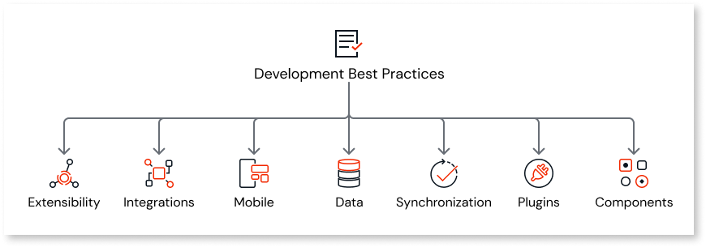

# Development

OutSystems lets you build great and secure web and mobile apps. In this section, you can find the best practices to help you build your apps in the most effective and efficient way. Navigate through the contents on the left to learn about the development best practices on different topics.

For more information on how to develop an app in OutSystems, see [Developing an Application](https://success.outsystems.com/documentation/11/developing_an_application/).
