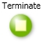
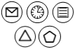
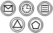
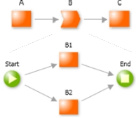

# Notation Reference for BPMN Practitioners

OutSystems allows designing and executing business processes through the Business Process Technology Add-on. This technical note describes the notation used for Process Modeling targeted at practitioners currently modeling processes using BPMN.

| **BPMN 1.2** |**Description**|**OutSystems Business Process Technology**|**Description**|
|-------------|-----------|-------------|---------------|
|| Plain Start Event| |**Start**, initiates the process.|
|| Plain End Event||  **End**, finishes a process flow. Theprocess may continue in parallelflows.|
|| Terminate Event||  **End with Terminate property set to Yes**, ends all flows of the process.|                                                                           
|| Start Event with a catching trigger: Message; Timer; Conditional; Signal or Multiple|| **Conditional Start**, initiates an alternative flow and may be triggered by a DB event or an explicit API call.|
||  Intermediate Event with a catching trigger: Message; Timer; Conditional; Signal or Multiple | | **Wait**, pauses the flow waiting for a timeout, a DB event, an API call or for a custom business logic returning true.|
|| Intermediate Event with a throwing trigger: Message; Signal or Multiple|| **Automatic Activity**, can be used to broadcast an event (via DB) or call an API to deliver an event to a specific activity or process.                                                           |
|| Task of type: Service, Script or Send (if not email)|| **Automatic Activity**, performs custom business logic in the application or in external systems.|
|| Task of type: User or Manual||  **Human Activity**, waits for a user or group to complete the given task.This activity shows up in the taskbox of one or more users.|
|| Task of type: Receive|| **Wait**, for the Receive semantics the application should call the Close Wait API when a message is received.|
|| Task of type: Send (for email)|| **Send Email**, sends a specified email message in the process flow.|
|| Reusable Sub-Process|| **Execute Process**, runs a subprocess. The parent process only proceeds after all flows of the subprocess finish.|
|| Exclusive Data-Based Decision (Gateway)|| **Decision**, directs to one outgoing gates based on custom business logic.|
||Exclusive Data-Based Decision (Gateway)||  **Connector**, defines the execution order of activities in the flow.|
||Parallel Split (Fork)|| **Fork**, two or more outgoing connectors (except when starting from a Decision) divide the flow into parallel paths.|
|| Fork and Join using a Parallel Gateway|| **Fork and Join**, is implemented by calling a sub-process with the two or more parallel paths that must be joined. The parent process only proceeds after all flows of the subprocess have ended.|
|| Text Annotation|| **Comment**, can be used to annotate any element or area of the process model.|
