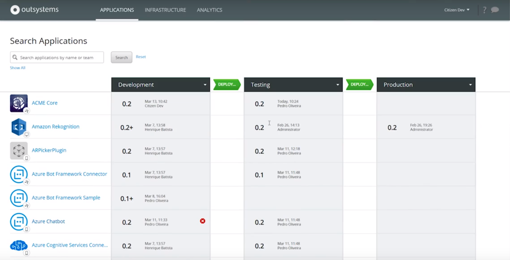
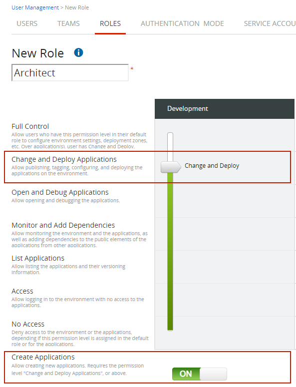
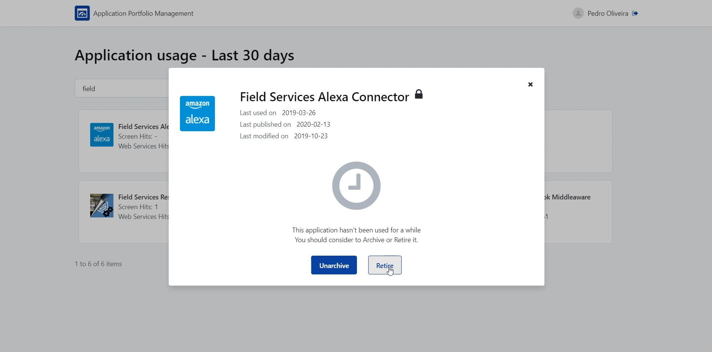
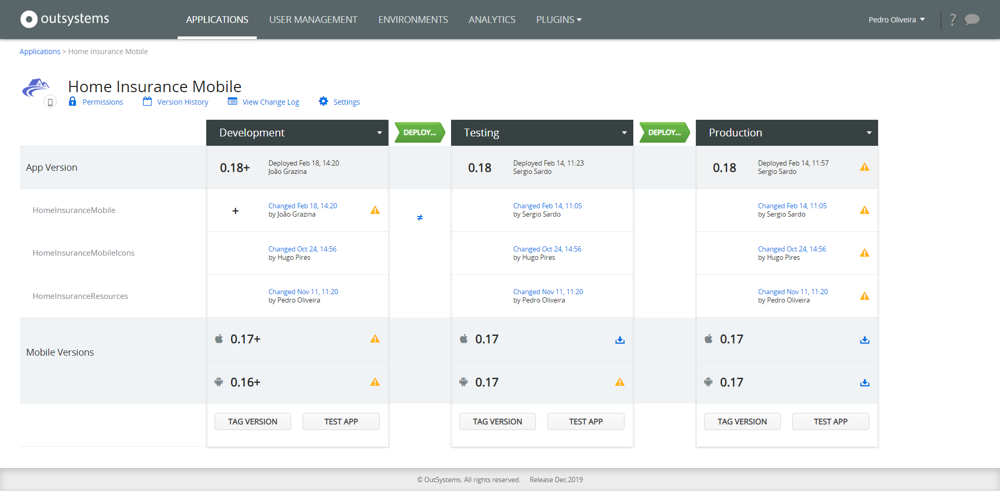

# Managing the Application Lifecycle of Your Portfolio

OutSystems provides out-of-the-box a unified console, [LifeTime](https://success.outsystems.com/Documentation/11/Managing_the_Applications_Lifecycle), to manage the applications’ lifecycle. It gives you visibility of all stages of your applications, manages the deployment of applications, IT users, and security across all environments.

For customers with large application portfolios, OutSystems highly recommends automating key portfolio management activities such as:

* [Integrating the application creation process with the business approval workflow](#manage-app-creation)

* [Detecting applications without owners](#ensure-app-ownership)

* [Creating automated actions for unused applications](#manage-unused-apps)

## Manage Application Creation { #manage-app-creation }

The OutSystems LifeTime includes a built-in mechanism that allows you to [control who is able to create applications](https://success.outsystems.com/Documentation/11/Managing_the_Applications_Lifecycle/Manage_IT_Users/Control_Who_Creates_Applications). 

With [APIs](https://success.outsystems.com/Documentation/11/Reference/OutSystems_APIs/LifeTime_API_v2), it is possible to automatically integrate the application creation step into your portfolio approval process. No matter if the process is done with an OutSystems app or a third-party tool. This reduces application sprawl by preventing new applications from being created without being associated with an approved business idea or need.

## Ensure Application Ownership { #ensure-app-ownership }

For organizations that follow Agile development practices, it is important to ensure that applications are monitored, maintained and evolved. Applications without an assigned user or team are at higher risk of experiencing security or performance issues.

OutSystems provides role-based permission configuration to define, not only who owns the application, but also who can develop, maintain and operate each application.

With [user management APIs](https://success.outsystems.com/Documentation/11/Reference/OutSystems_APIs/LifeTime_API_v2) it is possible to automatically flag applications that have lost a team owner, or a team where no members are available to maintain the application. Based on this automated detection you can easily define next steps, for example, triggering communication to other internal teams, archiving or retiring the application. Check the [Application Portfolio Manager](https://www.outsystems.com/forge/component-overview/7870/application-portfolio-manager) forge component to learn how to do this.

## Manage Unused Applications { #manage-unused-apps }

OutSystems allows you to automatically detect unused applications across all environments - development, test, production, etc. This way you can keep a clean portfolio of applications from the beginning by detecting the following types of situations:

* Apps with no visitors in production for more than a predefined number of days.

* Services that are not called or referenced by other applications for more than a predefined number of days.

Service Center provides these capabilities, which are used by the [Application Portfolio Manager](https://www.outsystems.com/forge/component-overview/7870/application-portfolio-manager) component. After flagging unused applications you can archive them, moving the application to an offline state.

It is also possible to retire applications. Note this will permanently delete the application from the environment. If you want to recover the application later ensure that you [download](https://success.outsystems.com/Documentation/11/Reference/OutSystems_APIs/LifeTime_API_v2#operation--applications--ApplicationKey--versions--VersionKey--content--get) and store a backup before it is retired.

It’s possible to check when an application was last updated by the development team. This can be done directly, through the LifeTime management console, or automatically via [APIs](https://success.outsystems.com/Documentation/11/Reference/OutSystems_APIs/LifeTime_API_v2#operation--applications--ApplicationKey--versions--VersionKey---get) by checking the creation date of deployed versions of your applications.

Additionally, through [APIs](https://success.outsystems.com/Documentation/11/Reference/OutSystems_APIs), it is possible to customize dashboards that allow you to detect applications that are not being used, based on other technical or business parameters.

All of these APIs can be integrated with third-party portfolio and application lifecycle management tools.
